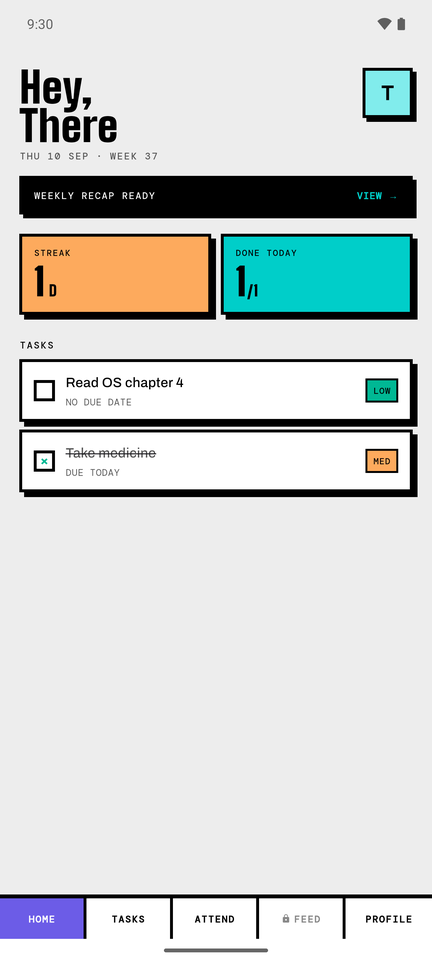
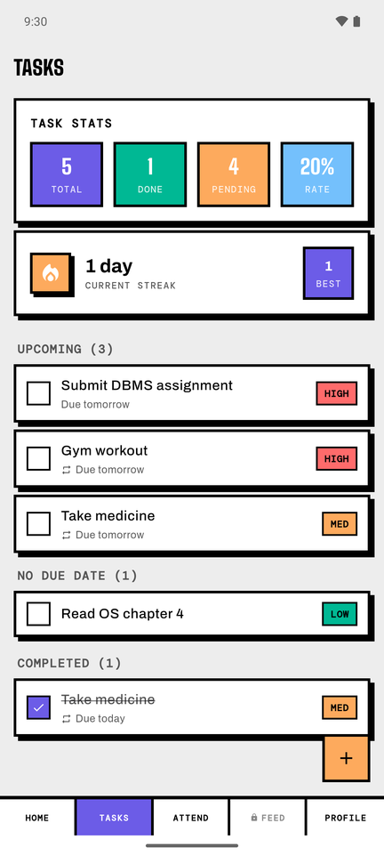
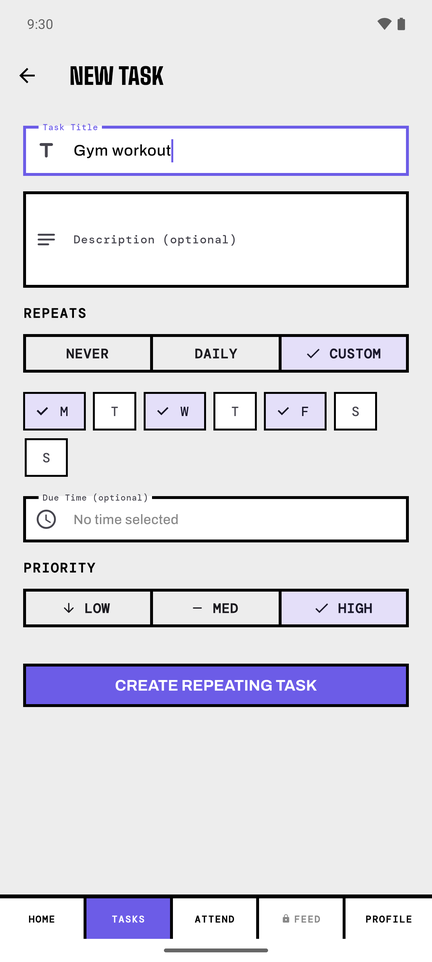
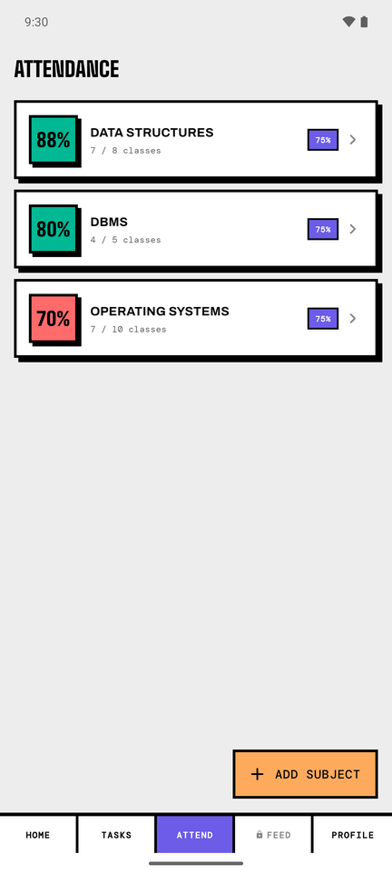
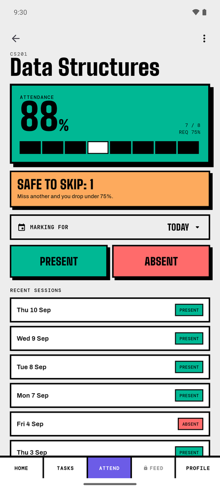
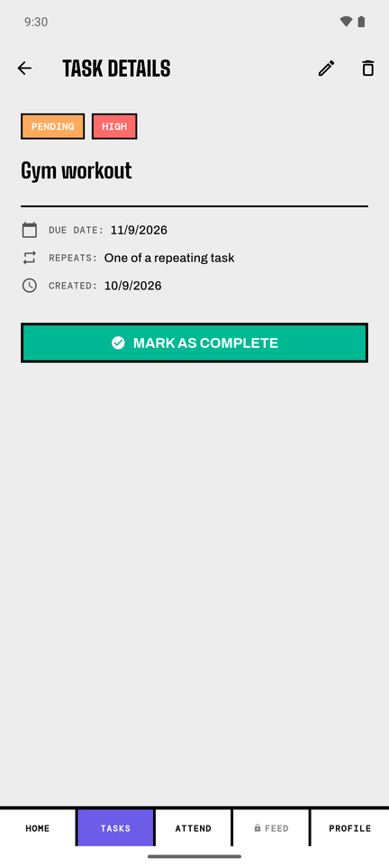
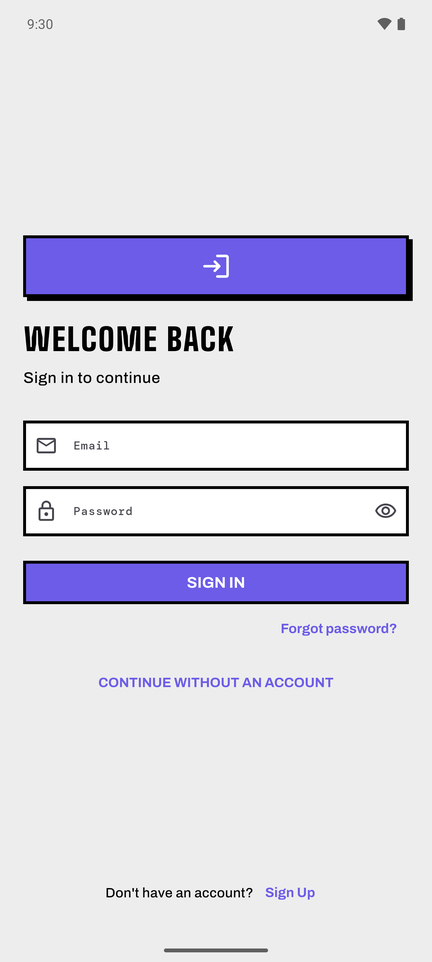
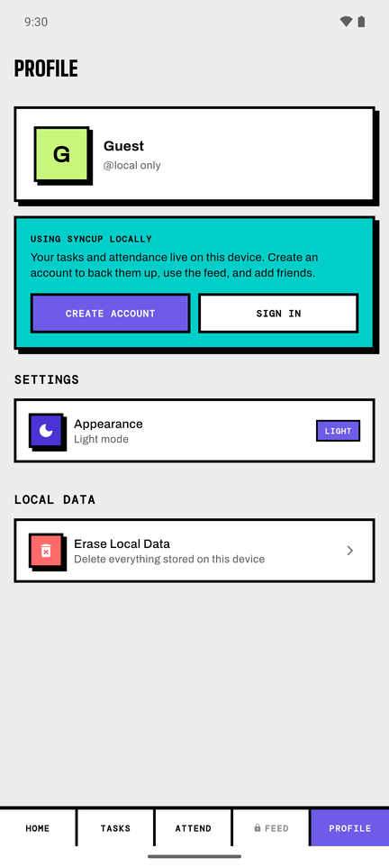
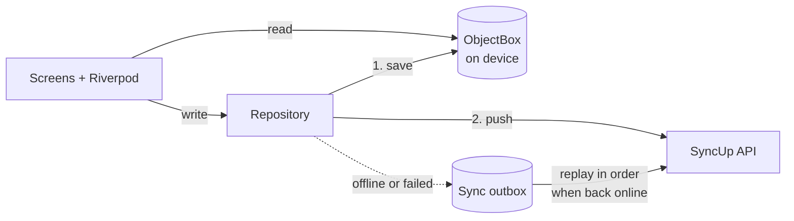

# SyncUp

**Track attendance, manage tasks, and stay in sync with your study group.**

SyncUp is a local-first Flutter app for students. Tasks, repeating habits, and class attendance live on the device and work with no connection at all; a sync engine mirrors every change to the server once you're back online, and friends see your progress in a shared feed.

<table>
  <tr>
    <td align="center"><br><sub><b>Home</b> — streak, today's progress</sub></td>
    <td align="center"><br><sub><b>Tasks</b> — grouped by when they're due</sub></td>
    <td align="center"><br><sub><b>Repeating tasks</b> — daily or chosen weekdays</sub></td>
  </tr>
  <tr>
    <td align="center"><br><sub><b>Attendance</b> — every subject at a glance</sub></td>
    <td align="center"><br><sub><b>Subject detail</b> — mark, backfill, undo</sub></td>
    <td align="center"><br><sub><b>Task detail</b></sub></td>
  </tr>
  <tr>
    <td align="center"><br><sub><b>Sign in</b> — or continue as a guest</sub></td>
    <td align="center"><br><sub><b>Guest mode</b> — no account, all on-device</sub></td>
    <td></td>
  </tr>
</table>

## Features

**Tasks**
- One-off tasks with an optional due date, due time, and priority
- Repeating tasks — every day, or on the weekdays you choose (e.g. a medicine, or gym on Mon/Wed/Fri)
- A repeating task shows as a single row: the occurrence that's next due, not a fortnight of copies
- Reminders at the due time, scheduled on-device so they fire offline
- Streaks, completion stats, and a weekly recap
- Mark any single task private to keep it out of your friends' feed

**Attendance**
- Subjects with a minimum-attendance threshold (e.g. 75%)
- One-tap PRESENT / ABSENT, with undo
- Backfill a day you forgot to mark — up to 30 days back

**Social**
- Friends and study groups
- A feed of completed tasks, respecting each user's privacy settings
- Share today's plan with your friends

**Account**
- Guest mode — the full app with no account, stored only on the device
- Email verification, password reset, per-device session management
- Notification preferences for push and local reminders
- Account deletion that removes all of your data from the server

## Architecture

SyncUp is **local-first**. The UI reads exclusively from an on-device [ObjectBox](https://objectbox.io) store; the API is a write-only mirror that the app never reads tasks back from. That keeps every screen at local-read speed and makes offline the normal case rather than an error path.



- **Write path** — every change is saved to ObjectBox first, then pushed to the API without blocking the UI. If the device is offline or the request fails, it goes to an outbox that [`SyncManager`](lib/core/sync/sync_manager.dart) replays in creation order as soon as connectivity returns. Guest writes wait in the outbox until the user signs in.
- **Idempotent by construction** — each occurrence of a repeating task gets a deterministic UUIDv5 derived from its series and date. Regenerating produces the same id, so a retried request, a replayed outbox entry, or a device restored from backup can never create a duplicate.
- **Repeating tasks** — occurrences are generated on-device 14 days ahead (so reminders can be scheduled offline), backfilling at most 30 days. A per-series watermark only moves forward, so an occurrence you deleted is never resurrected.

Each feature follows the same layered layout:

```
lib/
├── core/                  # shared infrastructure
│   ├── network/           # Dio client, auth interceptor (token refresh)
│   ├── router/            # go_router config, deep links
│   ├── storage/           # ObjectBox store and entities
│   ├── sync/              # SyncManager outbox, connectivity
│   ├── notifications/     # local + push notification plumbing
│   └── theme/             # neo-brutalist design system
└── features/
    ├── tasks/
    │   ├── data/          # DTOs, remote data source, repository impl
    │   ├── domain/        # entities, repository contracts, use cases
    │   ├── presentation/  # screens, view models, widgets
    │   └── di/            # Riverpod providers
    ├── attendance/  auth/  feed/  home/
    └── notifications/  onboarding/  profile/  social/
```

## Tech stack

| | |
|---|---|
| **Framework** | Flutter (Dart 3.10) |
| **State** | Riverpod 3 (`Notifier` / `NotifierProvider`) |
| **Navigation** | go_router with `StatefulShellRoute` tabs |
| **Local store** | ObjectBox |
| **Networking** | Dio, connectivity_plus |
| **Errors** | fpdart `Either<Failure, T>` across the domain layer |
| **Notifications** | Firebase Cloud Messaging, flutter_local_notifications |
| **Testing** | flutter_test, mocktail |

The backend lives in its own repository: **[SyncUp-Backend](https://github.com/Prakharpan-dey/SyncUp-Backend)** — Fastify, Drizzle ORM, PostgreSQL, and BullMQ on Redis.

## Getting started

**Prerequisites:** Flutter with Dart ≥ 3.10, and Android Studio or an Android device. To use accounts and sync, run the [backend](https://github.com/Prakharpan-dey/SyncUp-Backend) locally — or skip it and use guest mode, which needs no server.

```bash
git clone https://github.com/Prakharpan-dey/SyncUp.git
cd SyncUp
flutter pub get
flutter run
```

By default the app talks to `http://10.0.2.2:3000` — the Android emulator's address for a backend running on your own machine. Point it anywhere else with `--dart-define`:

```bash
flutter run --dart-define=API_BASE_URL=https://your-api.example.com
```

### Release builds

Always pass the API URL — without it, a release build points at `10.0.2.2` and every request fails on a real phone.

```bash
flutter build apk --release --dart-define=API_BASE_URL=https://your-api.example.com
flutter build appbundle --release --dart-define=API_BASE_URL=https://your-api.example.com
```

### Firebase

Android's Firebase config (`android/app/google-services.json`, `lib/firebase_options.dart`) is checked in, so push notifications work on Android out of the box. For iOS, generate `ios/Runner/GoogleService-Info.plist` with [`flutterfire configure`](https://firebase.google.com/docs/flutter/setup).

### After changing an ObjectBox entity

The generated `lib/objectbox.g.dart` and `lib/objectbox-model.json` are committed. Regenerate them whenever you change a class in `lib/core/storage/models/`, and commit both files together:

```bash
dart run build_runner build --delete-conflicting-outputs
```

## Testing

```bash
flutter analyze
flutter test
```
